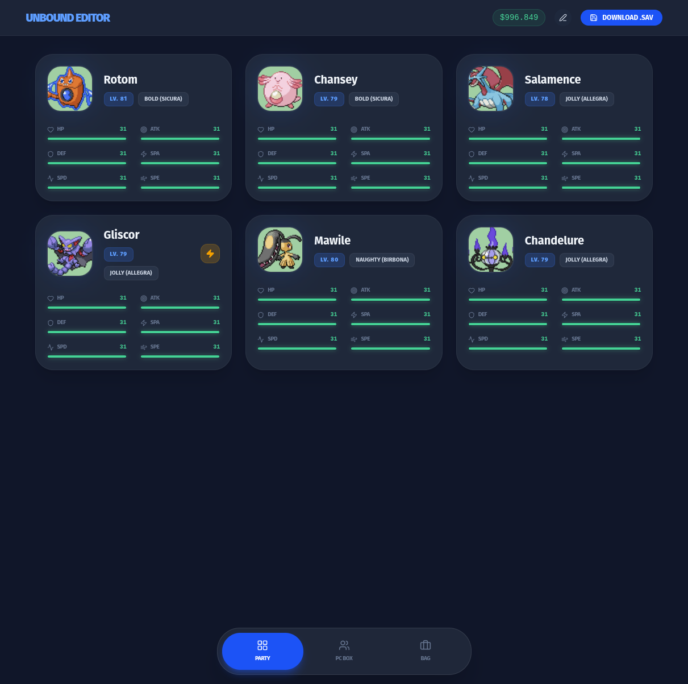
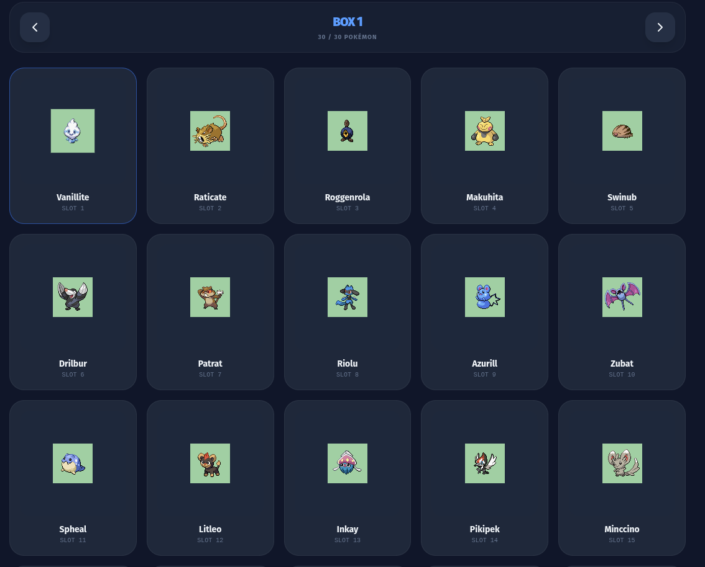
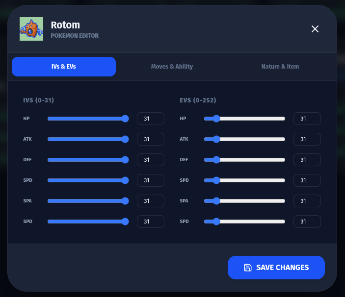
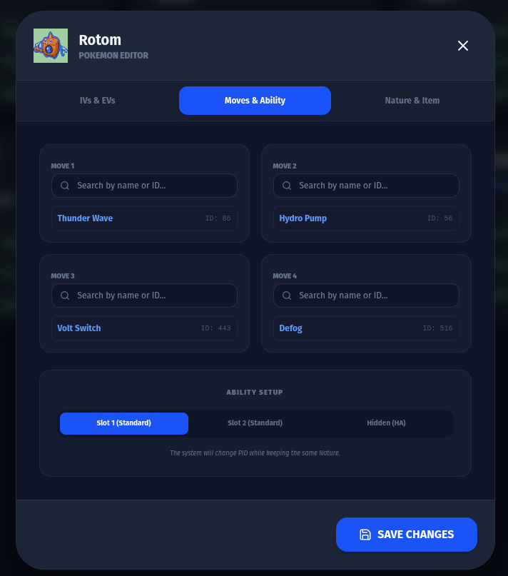
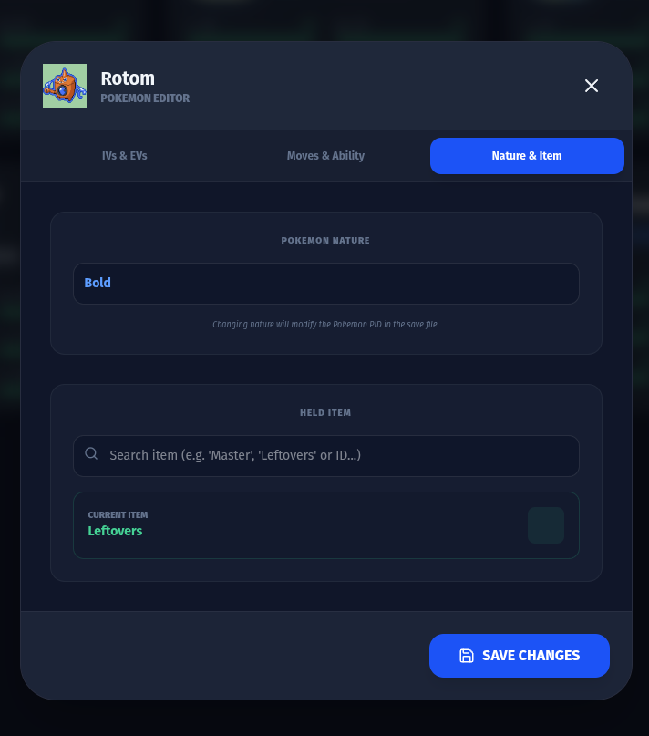
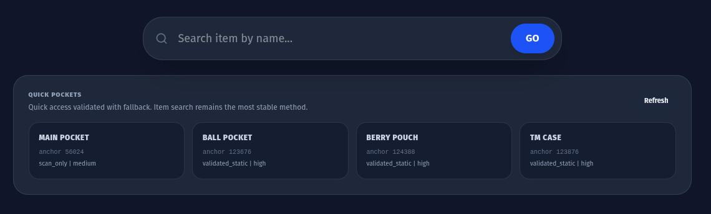
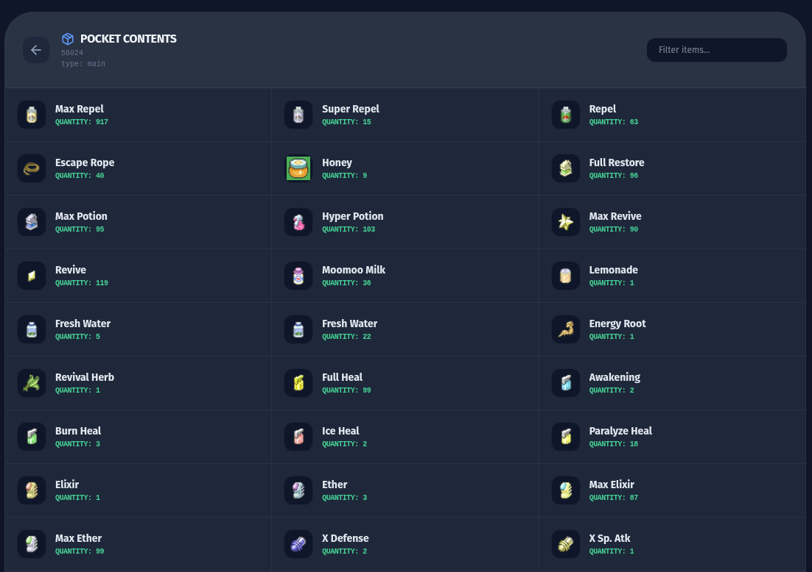
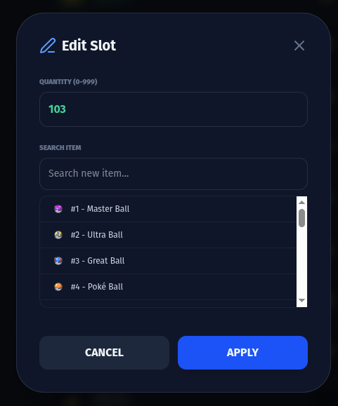

# PUSE - A Pokemon Unbound (online) Save Editor

> Live app: **[https://zannael.github.io/PUSE/](https://zannael.github.io/PUSE/)**

Web-based save editor for Pokemon Unbound (v 2.1.1.1) with a frontend-first architecture.
The app supports local in-browser save editing (recommended) and backend mode (fully compatible) if you prefer Python for debugging/developing purposes.

## Features

- Party editing (IV/EV/moves/ability/nature/item)
- PC editing
- Bag editing with pocket discovery (main, balls, berries, TM case)
- Money editing
- Save checksum recalculation and save export

## Runtime Modes

- **Local mode (`VITE_RUNTIME_MODE=local`)**: parsing/editing/checksum/export run completely in the browser.
- **Backend mode (`VITE_RUNTIME_MODE=backend`)**: uses FastAPI local endpoints.

## UI Walkthrough

### 1) Party and PC Overview

Team section with quick access to your current party Pokemon.



PC box section for browsing and editing boxed Pokemon.



### 2) Pokemon Editing Flow

Edit IVs and EVs with per-stat controls.



Edit moves and ability slot selection.



Edit level, nature and held item in the same modal flow.



### 3) Bag Editing Flow

Use **Quick Pockets** first for fast access (best on mature saves with many items/TMs).



If a pocket is missing (common on early saves), use the search bar as the reliable fallback: search an item you already have in that pocket (for example Potion or a TM/HM), then open the detected candidate.



After a pocket is opened, you can edit quantity/item ID and also add items that were not previously present in that pocket.



## Project Structure

- `frontend/` React + Vite UI
- `backend/` FastAPI API and save editing modules
- `backend/data/` static lookup tables (`items.txt`, `pokemon.txt`, `moves.txt`, `tms.txt`)

## Requirements

- Node.js 20+
- Python 3.10+

## Local Run

### Frontend

```bash
cd frontend
npm install
cp .env.example .env
npm run dev
```

Frontend default URL: `http://localhost:5173`

- For **frontend-only mode** (recommended), set in `frontend/.env`:
  - `VITE_RUNTIME_MODE=local`
- For **backend mode**, set in `frontend/.env`:
  - `VITE_RUNTIME_MODE=backend`
  - `VITE_API_BASE_URL=http://localhost:8000`

### Backend (only if using backend mode)

```bash
cd backend
python3 -m venv .venv
source .venv/bin/activate
pip install -r requirements.txt
cp .env.example .env
uvicorn main:app --reload --host ${BACKEND_HOST:-0.0.0.0} --port ${BACKEND_PORT:-8000}
```

## Docker

```bash
docker compose up --build
```

## Optional Pokemon Sprites

- Pokemon icon sprites are optional and not required to run the app.
- If missing, the backend logs a warning and returns a tiny fallback image, so UI keeps working.
- Source for icon assets:
  - `https://github.com/Skeli789/Dynamic-Pokemon-Expansion/tree/master/graphics/frontspr`
- To enable sprites locally, clone/copy that folder into:
  - `backend/icons/pokemon/`

### Frontend icon delivery (GitHub Pages / local mode)

- In frontend local mode, icons are resolved without backend endpoints:
  - Pokemon icons: `Skeli789/Dynamic-Pokemon-Expansion`
  - Item icons: `PokeAPI/sprites`
- Manifests are generated and committed under:
  - `frontend/src/data/pokemon-icon-manifest.json`
  - `frontend/src/data/item-icon-manifest.json`
- To refresh mappings after changing pinned commits or source lists:
  - Run `npm run icons:manifest` inside `frontend/`
  - (Optional CI/local guard) run `npm run icons:check`
- Unmapped IDs gracefully fall back to local placeholders in `frontend/public/icons/`.

## Optional Item Icons

- Item icons are optional and not required to run the app.
- If missing, backend item-icon lookup simply returns no icon and UI keeps working.
- Item icon sources are:
  - `https://github.com/PokeAPI/sprites` (item icons)
  - Leon's ROM Base item icon pack
- Place them like this:
  - Copy the PokeAPI item icon folder contents into `backend/icons/items/Base Items/`
  - Copy Leon's ROM Base item icon folders/files into `backend/icons/items/`
- The backend resolver checks `Base Items/` first (including subfolders), then falls back to the other folders in `backend/icons/items/`.

## Environment Variables

### Backend (`backend/.env`)

- `BACKEND_HOST` default `0.0.0.0`
- `BACKEND_PORT` default `8000`
- `CORS_ORIGINS` comma-separated origins

### Frontend (`frontend/.env`)

- `VITE_API_BASE_URL` backend base URL
- `VITE_RUNTIME_MODE` runtime mode (`backend` or `local`)
- `VITE_BASE_PATH` Vite base path (`/` for local dev, `/<repo>/` for project Pages)

## Deployment (Maintainers)

- Frontend deploy is handled by `.github/workflows/deploy-pages.yml`.
- One-time setup: in GitHub, go to `Settings -> Pages -> Source` and choose **GitHub Actions**.
- On push to `main` (or manual run), the workflow builds `frontend/dist` in local mode, sets `VITE_BASE_PATH=/<repo>/`, and copies `index.html` to `404.html` for SPA fallback.
- Icons in local mode are served from pinned CDN commits via generated manifests, so no backend icon folders are required on GitHub Pages.

## Safety Notes

- Always work on copies of your `.sav` files (even if the code SHOULD never touch you original one).
- Keep personal `.sav`/ROM files under `backend/local_artifacts/` (ignored by git).
- Never share personal saves publicly in issue reports.
- This project is community-maintained and evolving.

## Disclaimer

This project is an unofficial fan-made utility. Use it only with legally obtained game files and your own save data.
